# RegEx-artikel_CMDA-Minor-Web

RegEx is een afkorting van Regular Expression en is een mannier om patronen te beschrijven in tekst of code. Een veel voorkomend probleem is dat wanneer gebruikers tekst opsturen, dat de aangeleverde tekst niet de structuur heeft die jij kan gebruiken in code.
Om een voorbeeld te geven, wanneer iemand alle emails wilt verzamelen uit al het mailverkeer, komen er diverse voormaten voorbij. 
Denk hierbij aan: 
1. voornaam.achternaam@gmail.com
2. voornaam-achternaam@123mail.nl
3. v00rn44m_4cht3rn44m@yahoo.com
4. voornaam@achternaam.nl

Met regex is is het dus mogelijk om bepaalde patronen te herkennen van de content. Een lastig onderwerp is het valideren van email adressen. Je kan niet zien of een email daadwerkelijk bestaat, maar je zou wel kunnen kijken of het mailadres voldoet aan de standaarden. Wanneer we voorbeeld 1 gaan ontleden zien we een aantal verschillende karakters. Om te beginnen zien we letter karakters, een punt en een @. Om een letter te matchen kunnen we \w gebruiken. \w matcht met alles wat een woordkarakter is. Als we nu “voornaam” willen selecteren zouden we dat als volgt kunnen doen: \w\w\w\w\w\w\w\w . 
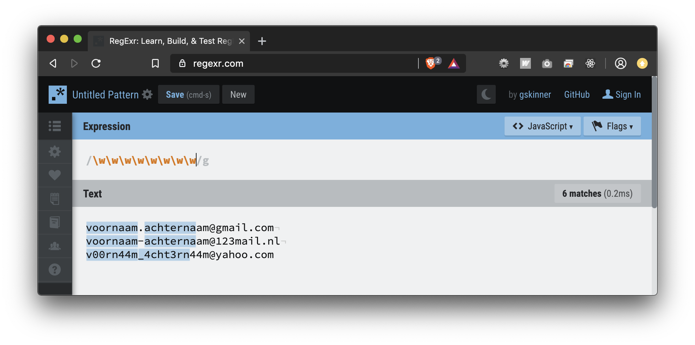

Door 8 keer \w te herhalen worden nu alle matches weergegeven waar 8 woordkarakters achter elkaar staan.  Om ervoor te zorgen dat \w niet de letter “w” zou selecteren, wordt er een backslash gebruikt. Dit zorgt ervoor dat bepaalde karakters gebruikt kunnen worden binnen de RegEx taal. Als er gebruik gemaakt wordt van de \ wordt dat ook wel escaping genoemd. Zodra alles nu tot en met de .com geselecteerd moet worden, kan dat er als volgt uit zien: \w\w\w\w\w\w\w\w\.\w\w\w\w\w\w\w\w\w\w@\w\w\w\w\w\.com. 
![[rx2.png]](rx2.png)

Het valt je misschien op dat de . ook geëscaped wordt, dit komt omdat de . normaal elk karakter zou matchen die denkbaar is. Nu zal voorbeeld 1 geselecteerd worden, maar elk afwijkende combinatie niet. Denk hierbij aan de extensies zoals .nl. of .org, maar ook de verhouding van 18 karakters voor de @. Om dit gemakkelijk op te delen zijn er de volgende Quantifiers beschikbaar:

* 	= selecteert alle overeenkomende karakters van 0 of meer achter elkaar
+ 	= selecteert alle overeenkomende karakters van 1 of meer achter elkaar
? 	= selecteert alle overeenkomende karakters van 0 of 1 
{3}	= selecteert alle overeenkomende karakters van exact 3 achter elkaar. Hier kan elk getal ingevuld worden
{1-4}	= selecteert alle overeenkomende karakters in een reeks van 1 tm 4

Om slim gebruik te maken van deze hulpmiddelen kunnen we onze RegEx als volgt aanpassen: \w+\W*\w+@\w+\d*\.com

De quantifiers die we hier gebruiken zijn de + en de *. Omdat elk mailadres minstens 1 letter moet bevatten kunnen we de plus gebruiken, en omdat er niet altijd een . In het begin van een email adres te vinden is, gebruiken we hier de asterisk. De RegEx code werkt nu op voorbeeld 1, maar zodra we deze RegEx gaan toepassen op voorbeeld 2 dan gaat het mis. Doordat voorbeeld 2 een - in het eerste gedeelte bevat, kan deze niet gematched worden. Om een karakter te matchen kunnen we altijd de \. gebruiken om elke karakter te matchen, maar om specifieker te zijn kunnen we \W toepassen. \W wordt gematched aan alles wat geen woordkarakter is. Om vervolgens de cijfers van 123mail te matchen kunnen we de \d gebruiken. De d uit dit voorbeeld staat voor digit, en matched dus elk getal van 0-9. De RegEx van voorbeeld 1 en 2 zou als volgt geschreven kunnen worden: \w+\W*\w+@\w+\d*\.\w+

Om de uitkomst van de RegEx code meer structuur te geven, kan er gebruik gemaakt worden van groepen. Een groep kan worden aangegeven met haakje openen en haakje sluiten. De RegEx uit het vorige voorbeeld zou er als volgt uit komen te zien: (\w+\W*\w+)@(\w+\d*)(\.\w+). 
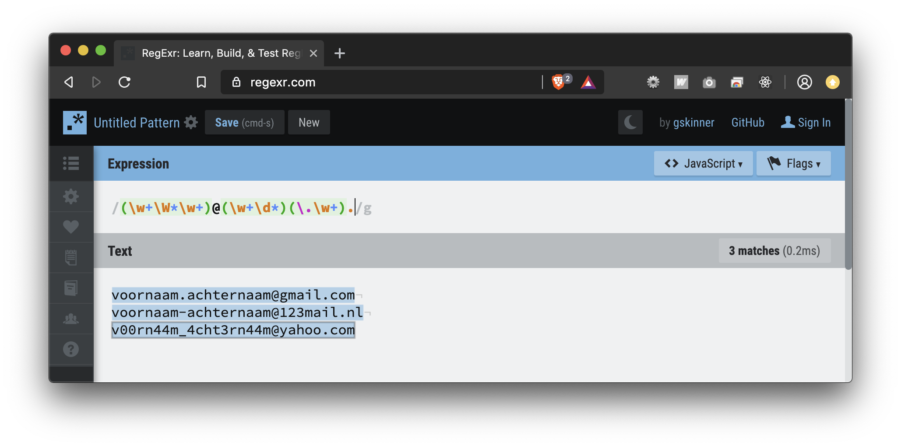

In dit voorbeeld is het eerste gedeelte tot de @ in een groep gezet, vervolgens de provider in een aparte groep en als laatst de extensie. Om een bepaalde groep op te vragen moet je de volgende syntax toepassen: $1 . In dit voorbeeld selecteren we alle overeenkomsten van groep 1. Als we een andere groep willen aanspreken, kunnen we het cijfer veranderen naar het corresponderende nummer van die groep.

Naast het clusteren in groepen is het ook mogelijk om karakters op te sommen die er mogelijk in zouden kunnen zitten. Dit is mogelijk door de brackets te gebruiken. Het voordeel hiervan is dat je heel specifiek kan aangeven welke characters er voor kunnen komen binnen de selectie die je wilt maken. Je zou als volgt de speciale karakters kunnen opvragen voor de emails: ([\_\-\.]).
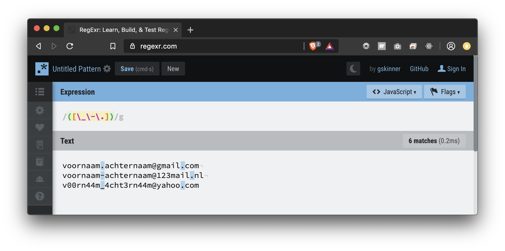

Hier wordt gekeken naar alle lage strepen, de normale strepen en alle punten binnen een tekst. Het is ook mogelijk om dit negatief te selecteren, dus dat alles wat niet overeen komt met deze karakters geselecteerd wordt. Dit zou er als volgt uitzien: ([^\_\-\.]).
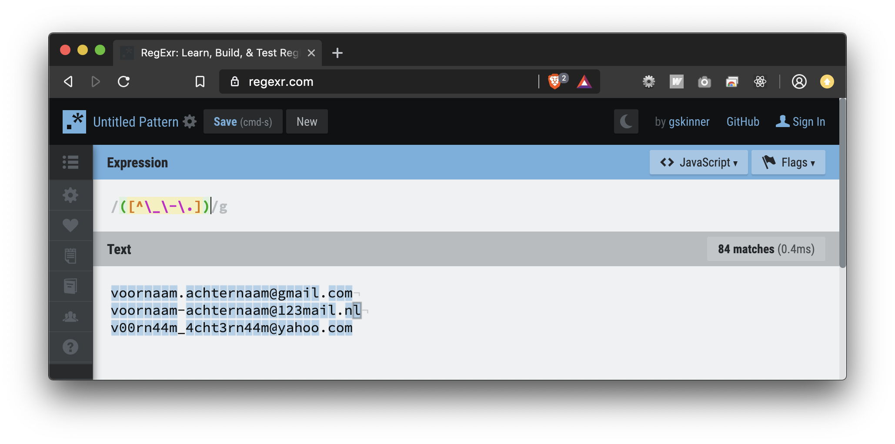

Door het gebruik van de ^ caret geef je aan dat iets niet moet matchen. Het is ook mogelijk om aan te geven in welke gevallen er iets wordt geselecteerd. Dit gebeurd door middel van een | sluisteken. De code zou er als volgt uit kunnen zien: (-|_). 
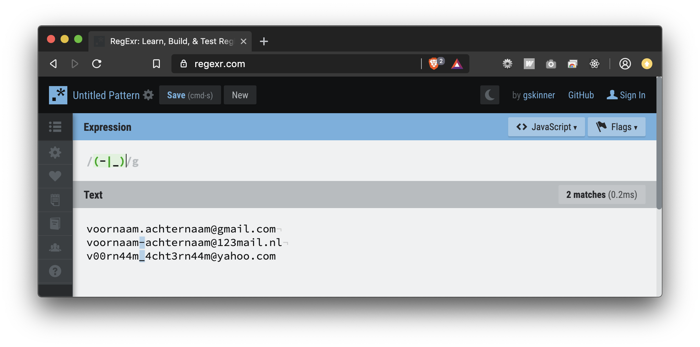

Wanneer iemand specifiek alle spaties zou willen selecteren, kan daar de \s voor worden gebruikt. 
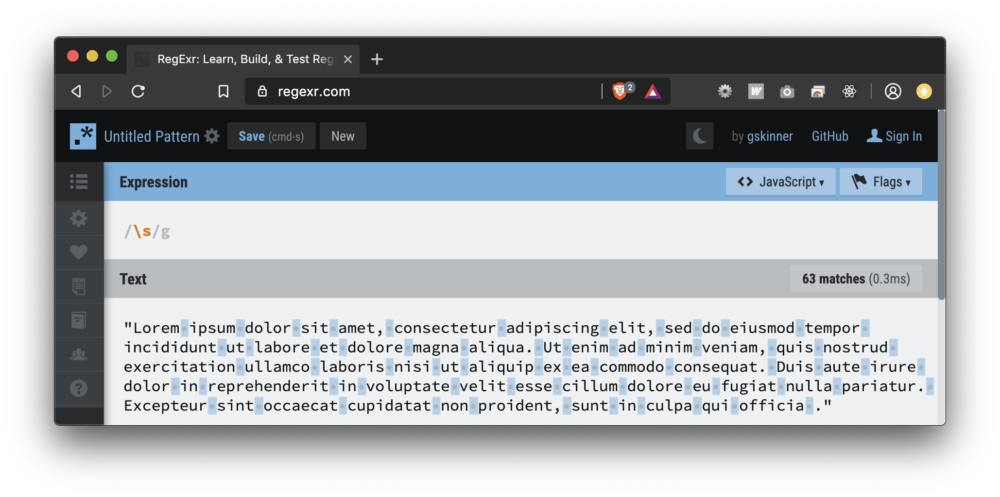

Mocht je nou alles willen selecteren wat geen spatie is, gebruik dan de \S. 
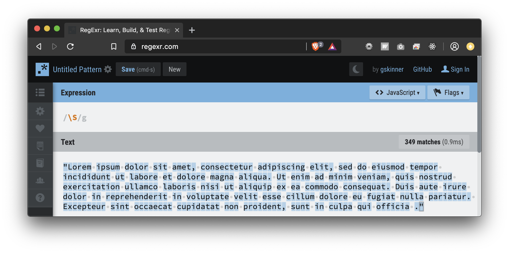

Als je in de situatie komt dat je elke beginletter van een bepaalde woordbinding wilt gebruiken, kan je \b gebruiken, waarmee je de eerste letter van een woordbinding kan selecteren. 
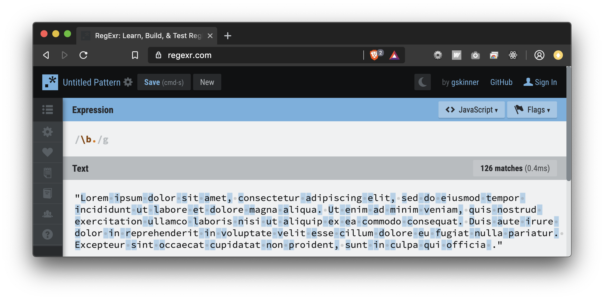

Mocht je alles willen selecteren wat niet de beginletter van een woordbinding is, dan gebruik je \B. 
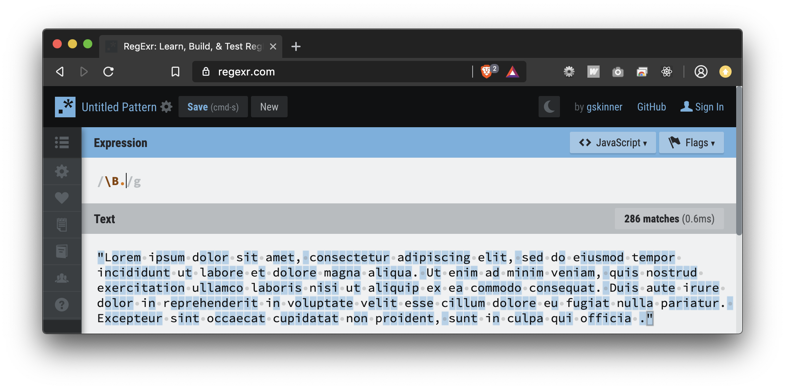

Ook heb je de beschikking om elk begin van een string te selecteren, dit kan je doen door middel van de ^ caret. 
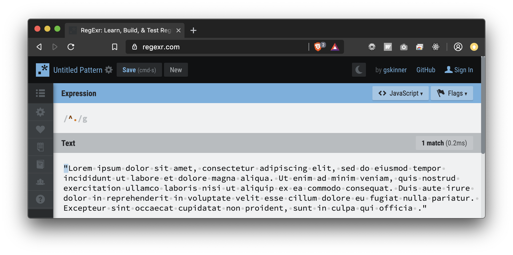

Het is ook mogelijk het einde van een string te selecteren, dit doe je met behulp van het $ dollarteken 
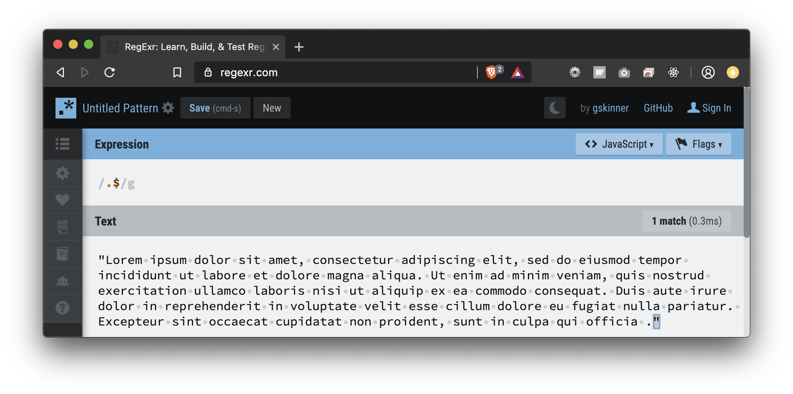